# SAP ABAP Project: Warehouse Storage Location & Material Distribution Explorer

> **倉儲儲位物料分佈探索器** — 三層互動式庫存報表 × 內部調撥補貨系統

#### [本專案採用 Github Copilot 與 Gemini AI 工具進行協作開發]

---

## 專案介紹 (Project Introduction)

本專案以 SAP **GBI / GBIKE** 企業的倉儲管理為背景，採用 **100% OO ABAP** 開發，整合「三層互動式庫存報表」與「內部調撥補貨系統」。

系統突破 SAP 標準 T-Code（如 LS26）單筆查詢的限制，讓倉管人員可由工廠層級逐步下鑽至儲位層級，透過低庫存顏色警示快速辨識異常，並直接在畫面上建立與追蹤內部補貨任務，形成一套完整的「發現缺貨 → 建立補貨 → 閉環確認」流程。

> Built on SAP GBI / GBIKE warehouse data, this project uses **100% OO ABAP** to deliver a three-tier interactive inventory report and an integrated internal replenishment system — breaking through the limitations of standard SAP T-Codes to enable a seamless end-to-end workflow from anomaly discovery to replenishment confirmation.

---

## 核心功能 (Core Features)

### 1. 三層互動式庫存報表 (Three-Tier Interactive Inventory Report)

| 層級 | 名稱 | 顯示內容 | 核心資料表 |
|------|------|----------|------------|
| **Level 1** | 物料預警層 | 彙總全廠各物料總庫存；可用庫存 < 10 整列標紅警示，並顯示補貨提醒 | `LQUA` `MAKT` `MARC` |
| **Level 2** | 儲位分佈層 | 展開物料在各倉儲類型與具體儲位的庫存明細；低庫存儲位標紅 | `LQUA` |
| **Level 3** | 儲位屬性層 | 揭露儲位最大容量重量、已使用重量與入庫凍結狀態（防呆機制）；附帶關聯庫存明細 | `LAGP` |

### 2. 內部調撥補貨系統 (Internal Replenishment System)

將報表從「查詢工具」升級為「作業入口」，消除資訊檢視與行政執行間的落差：

- **即時觸發：** 在 Level 2 雙擊紅色低庫存儲位，直接喚起 Screen 9000 補貨對話視窗
- **智慧自動帶入：** 系統自動填入物料、工廠、倉庫、目標儲位，並搜尋具備庫存的上游來源儲位與建議補貨數量
- **多層防呆檢核：** 阻擋數量 ≤ 0、來源庫存不足、儲位凍結、來源目標相同等異常
- **閉環追蹤：** 補貨單建立後自動切換至任務追蹤清單，即時顯示轉帳單號與完整明細

---

## 資料庫設計 (Database Design)

### ER Model

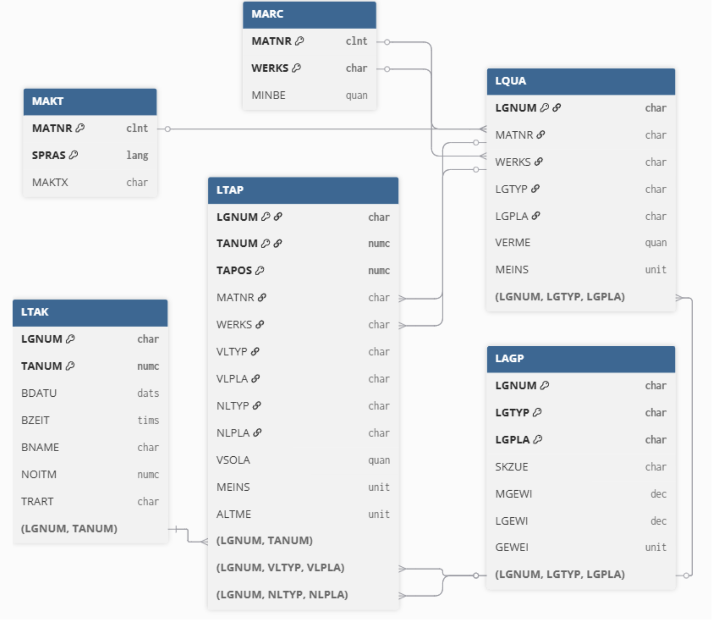

**圖 1：ER Model** — 系統使用六張 SAP 標準資料表，分為報表查詢層（LQUA / MAKT / MARC / LAGP）與補貨作業層（LTAK / LTAP）。

### 資料表說明 (Table Reference)

#### 報表查詢層

| 資料表 | 名稱 | 商業用途 |
|--------|------|----------|
| `LQUA` | 儲位庫存明細表 | 核心查詢來源；取得各物料在各儲位的可用庫存量（`VERME`），作為低庫存判斷基礎 |
| `MAKT` | 物料說明表 | 依物料代碼與語言別取得物料中文描述（`MAKTX`），提升報表閱讀效率 |
| `MARC` | 工廠物料表 | 提供物料於工廠層級的安全庫存（`MINBE`），作為庫存健康判斷參考 |
| `LAGP` | 儲位主檔表 | 提供儲位物理限制與凍結狀態（`SKZUE` / `MGEWI` / `LGEWI`），用於防呆檢核 |

#### 補貨作業層

| 資料表 | 名稱 | 商業用途 |
|--------|------|----------|
| `LTAK` | WM 轉帳單抬頭表 | 儲存補貨任務抬頭資訊——轉帳單號（`TANUM`）、倉庫號碼、建立者、建立日期時間 |
| `LTAP` | WM 轉帳單項目表 | 儲存補貨任務項目明細——物料、來源儲位、目標儲位、搬運數量 |

#### 關鍵欄位速查

```
LQUA : LGNUM / MATNR / WERKS / LGTYP / LGPLA / VERME / MEINS
MAKT : MATNR / SPRAS / MAKTX
MARC : MATNR / WERKS / MINBE
LAGP : LGNUM / LGTYP / LGPLA / SKZUE / MGEWI / LGEWI / GEWEI
LTAK : LGNUM / TANUM / BDATU / BZEIT / BNAME / NOITM / TRART
LTAP : LGNUM / TANUM / TAPOS / MATNR / WERKS / VLTYP / VLPLA / NLTYP / NLPLA / VSOLA / MEINS
```

---

## 系統操作指南 (Operation Guide)

### Step 0 — 初始查詢介面

於 T-Code `SE38` 執行程式，進入初始篩選畫面。可輸入倉庫號碼（`LGNUM`）與物料代碼（`MATNR`）範圍進行查找，或不輸入條件以列出所有物料。

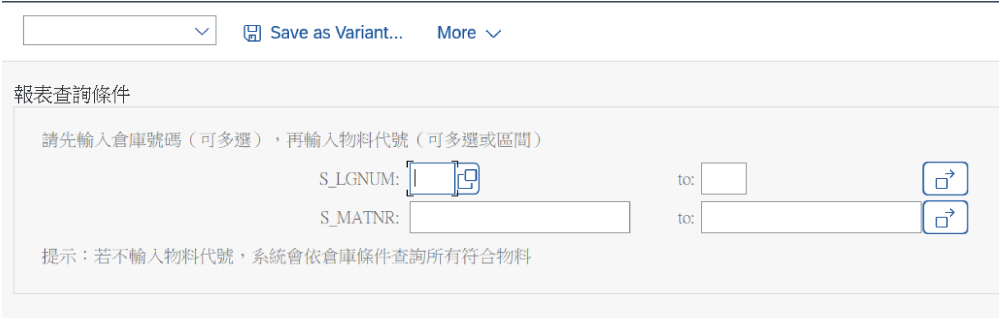

**圖 2：報表初始輸入介面** — 提供 Select-Options 範圍查詢，突破 LS26 單筆查詢限制；留空執行可列出倉庫中所有物料。

---

### Step 1 — Level 1：物料預警層

顯示欄位：`物料代碼(MATNR)` / `物料說明(MAKTX)` / `工廠(WERKS)` / `總可用庫存(VERME)` / `安全庫存(MINBE)`

- 總可用庫存（全儲位加總）**< 10** → 整列標紅 + 畫面上方顯示補貨提醒
- `MINBE` 欄位預留於介面，待資料完備後可直接切換判斷邏輯，無需修改程式
- 下方統計列表顯示物料總筆數與低庫存筆數
- **操作：** 點擊任一資料列 → 展開至 Level 2

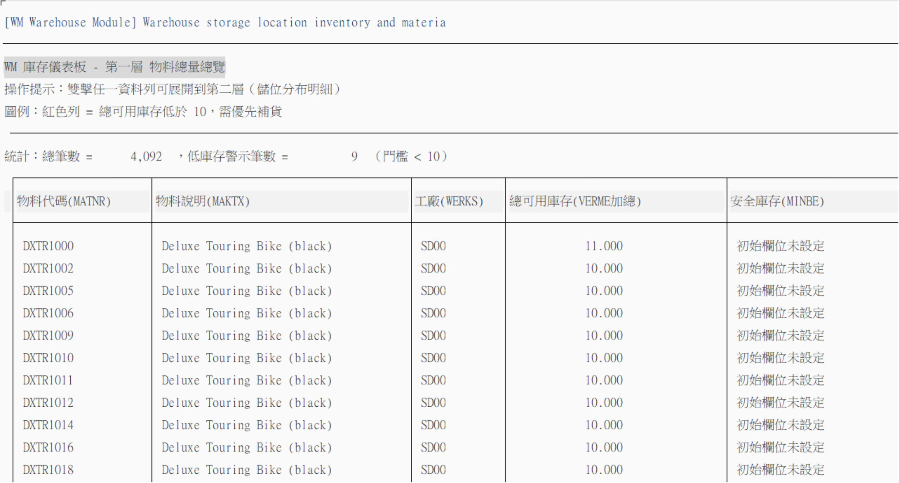

**圖 3：第一層報表介面** — 彙總全廠各物料的可用庫存總量，欄位標頭附中文說明。`MINBE`（安全庫存）欄位預留，未來資料到位後可直接切換為與其比對的判斷邏輯。

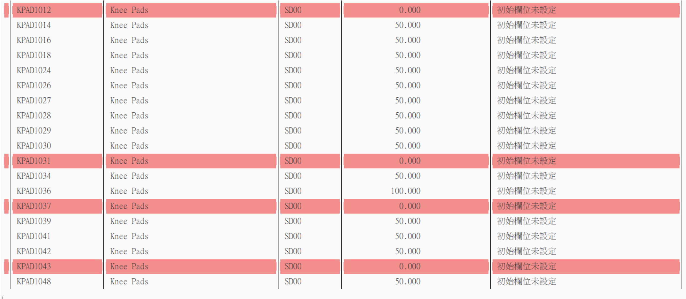

**圖 4：物料補貨提醒功能** — 當某物料的總可用庫存（VERME 加總）低於門檻值 10 時，整列標紅並在表格頂端顯示補貨提醒，讓倉管人員一眼辨識需優先處理的物料。

---

### Step 2 — Level 2：儲位分佈層

顯示欄位：`物料代碼(MATNR)` / `倉庫號碼(LGNUM)` / `倉庫類型(LGTYP)` / `儲位(LGPLA)` / `可用庫存(VERME)`

- 儲位可用庫存 **< 10** → 整列標紅 + 統計低庫存筆數
- **雙擊一般庫存列** → 展開至 Level 3（查看儲位物理屬性）
- **雙擊紅色低庫存列** → 直接觸發補貨對話視窗（Screen 9000）

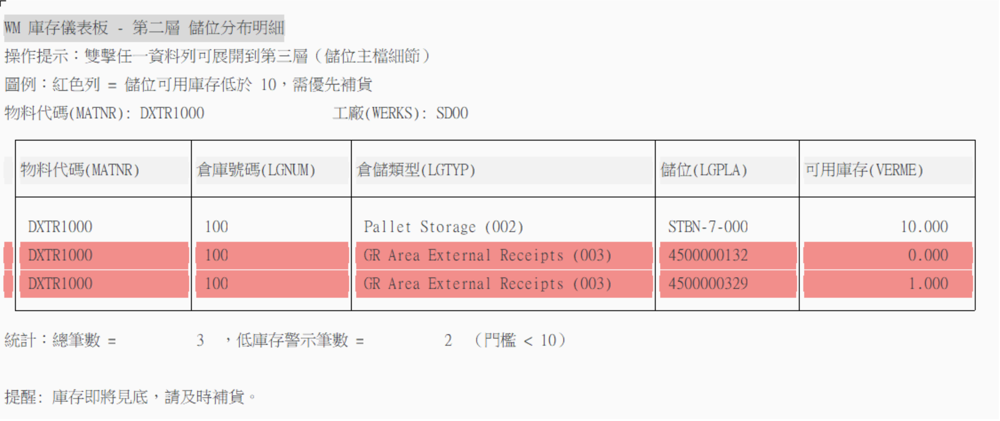

**圖 5：第二層報表介面（DXTR1000 物料）** — 展開 DXTR1000 在各儲位的庫存分佈。儲位 4500000132（庫存 0）與 4500000329（庫存 1）因低於門檻而標紅；STBN-7-000（庫存 10）正常。標紅列可直接雙擊觸發補貨。

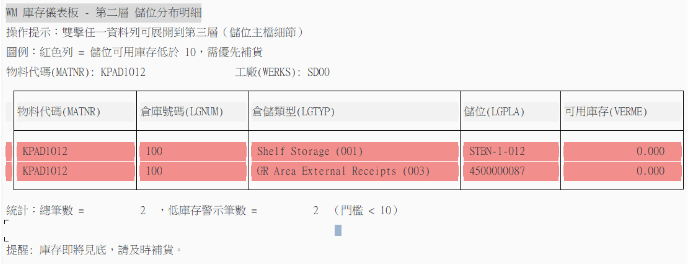

**圖 6：第二層報表介面（KPAD1012 物料）** — 展開 KPAD1012 的儲位分佈。STBN-1-012（001 Shelf Storage）與 4500000087（003 GR Area）的庫存皆為 0，兩列皆標紅，顯示此物料全部儲位皆已缺貨。

---

### Step 3 — Level 3：儲位屬性層

顯示欄位：`倉庫號碼(LGNUM)` / `倉庫類型(LGTYP)` / `儲位(LGPLA)` / `入庫凍結狀態(SKZUE)` / `最大容量重量(MGEWI)` / `已使用重量(LGEWI)`

- 揭露儲位物理限制與凍結狀態，防止入庫至超重或凍結儲位
- 下半部顯示該儲位「關聯庫存明細（Associate Traversal）」——列出所有物料及各自的可用庫存
- 點擊此層任一列 → 彈出提示（已達最底層，無法繼續展開）

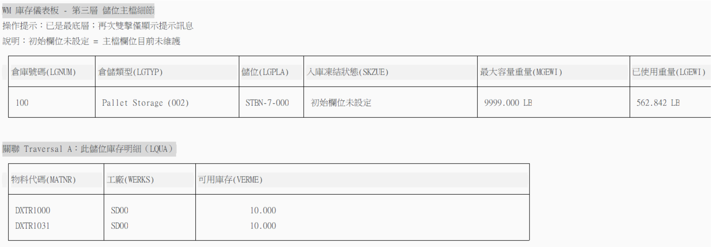

**圖 7：第三層報表介面（STBN-7-000 儲位）** — 顯示 STBN-7-000 的物理屬性：最大容量重量 9999 LB，已使用重量 562.842 LB，資料與 LS03N 核對一致。下半部關聯明細顯示該儲位含 DXTR1000 與 DXTR1031 兩種物料。

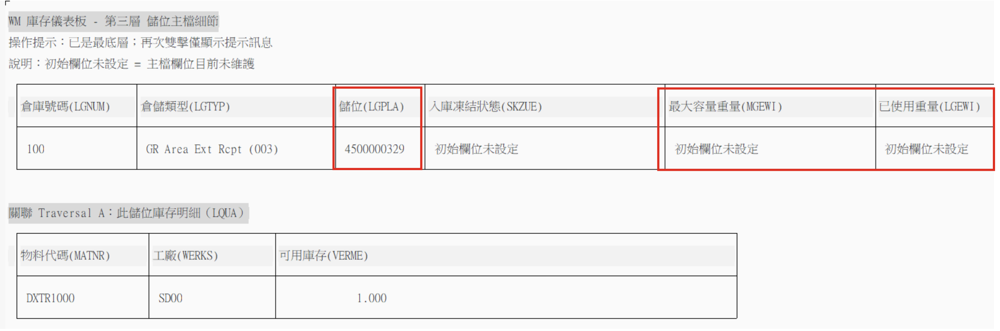

**圖 8：第三層介面（4500000329 儲位）** — 此儲位未設定容量重量，MGEWI 與 LGEWI 均顯示「初始欄位未設定」。並非所有儲位皆有重量設定，系統可正常處理此情況。

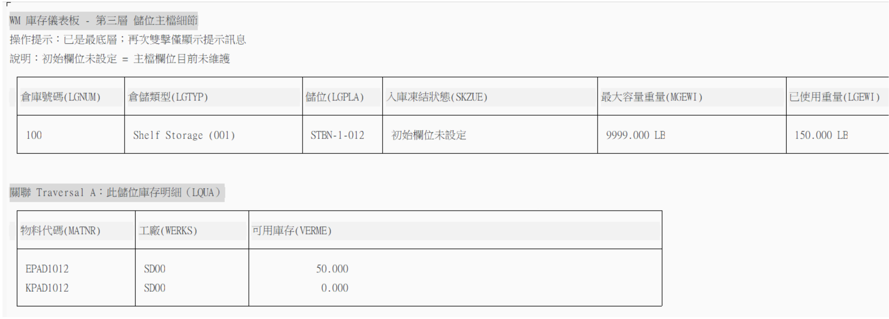

**圖 9：第三層報表介面（STBN-1-012 儲位）** — 顯示 STBN-1-012 的物理屬性與關聯庫存明細，儲位內包含 EPAD1012 與 KPAD1012 兩種物料。

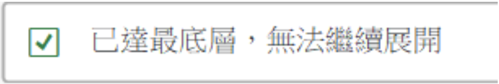

**圖 10：跳轉彈窗介面** — 點擊 Level 3 任一資料列時，系統彈出提示告知使用者「已達最底層，無法繼續展開」，防止誤操作並給予明確的操作回饋。

---

### Step 4 — 內部調撥補貨（Screen 9000）

在 Level 2 **雙擊紅色低庫存儲位**後，系統透過 `AT LINE-SELECTION` 接收鍵值並呼叫 `CALL SCREEN 9000`，進入補貨對話視窗。


**圖 11：DXTR1000 報表第二層介面** — 操作提示說明雙擊低庫存列（< 10）可直接建立補貨任務。以 4500000329（庫存 1，缺少 9 個單位）為例雙擊觸發 Screen 9000。

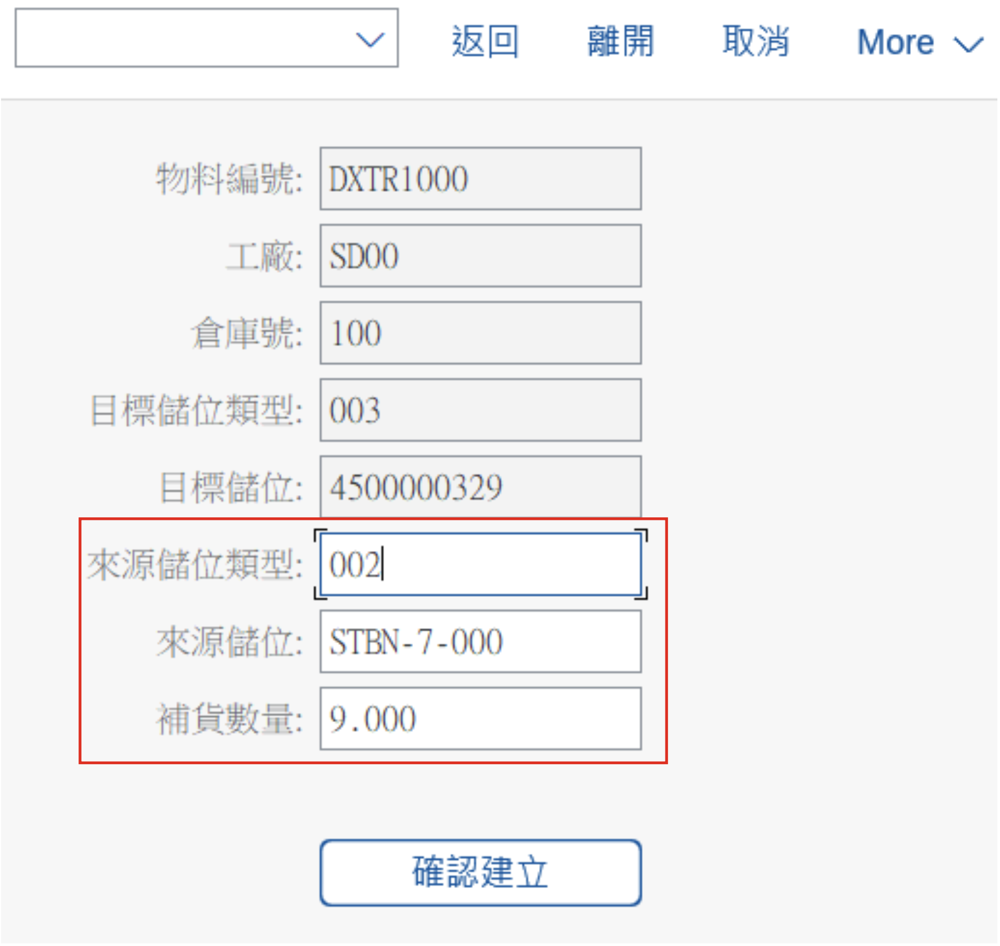

**圖 12：內部調撥補貨介面（Screen 9000）** — 進入視窗後，物料、工廠、倉庫、目標儲位類型與目標儲位（4500000329）由系統自動帶入為唯讀欄位。系統同時自動搜尋上游庫存，預填來源儲位（STBN-7-000）與建議補貨數量（9.000）。倉管人員確認後點擊「確認建立」送出。

| 欄位類型 | 欄位 |
|----------|------|
| **唯讀（系統自動帶入）** | 物料編號 / 工廠 / 倉庫號 / 目標儲位類型 / 目標儲位 |
| **可輸入（倉管人員確認）** | 來源儲位類型 / 來源儲位 / 補貨數量 |

**防呆機制（Validation）：**

| 防呆情境 | 訊息類型 | 觸發位置 |
|----------|----------|----------|
| 數量未輸入 / ≤ 0 | `Type E` | `dialog_pai` |
| 來源儲位庫存不足 | `Type E` | `dialog_pai` |
| 儲位處於凍結狀態 | `Type E` | `dialog_pai` |
| 來源與目標儲位相同 | `Type E` | `dialog_pai` |
| 補貨數量格式無法轉換 | `Type E` | `dialog_submit` |

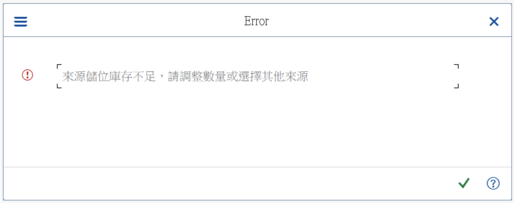

**圖 13：儲位與數量警示信息** — 當填入的來源儲位庫存不足，系統顯示 Type E 錯誤「來源儲位庫存不足，請調整數量或選擇其他來源」，阻止送出並要求重新輸入。

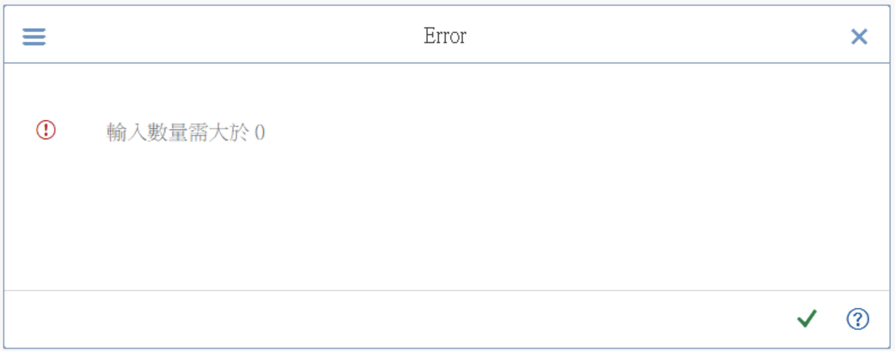

**圖 14：數量警示信息** — 當補貨數量未填或小於等於 0，系統顯示 Type E 錯誤「輸入數量需大於 0」，防止無效補貨任務建立。

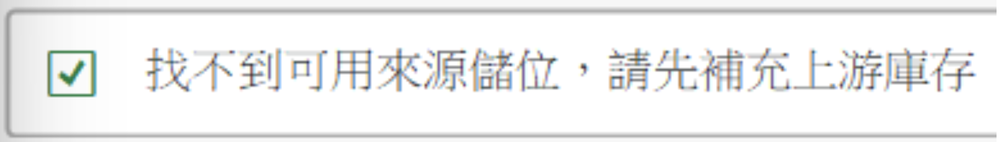

**圖 15：上游補貨通知信息** — 當物料所有儲位庫存皆為 0（如 KPAD1012），系統在 Level 2 即阻擋進入 Screen 9000，顯示「找不到可用來源儲位，請先補充上游庫存」，告知倉管人員需從上游進貨。

---

### Step 5 — 任務追蹤清單（閉環確認）

補貨任務成功建立後，系統自動寫入 `LTAK`（抬頭）與 `LTAP`（項目），並透過 `SUPPRESS DIALOG` + `LEAVE TO LIST-PROCESSING` 切換至追蹤報表。

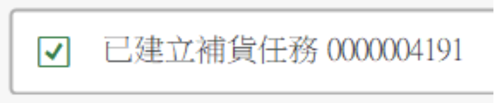

**圖 16：建立成功 Message** — 補貨任務建立成功時顯示 Type S 訊息「已建立補貨任務 XXXXXXXXXX」，讓倉管人員即時確認轉帳單號（TANUM）已落庫。

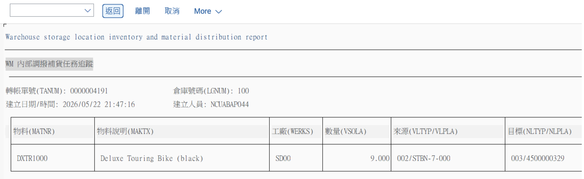

**圖 17：內部調撥補貨任務追蹤介面** — 自動切換至追蹤清單，顯示完整任務資訊：
- **抬頭：** 轉帳單號（`TANUM`）/ 倉庫號碼 / 建立日期與時間 / 建立人員
- **項目：** 物料代號 / 物料說明 / 工廠 / 補貨數量 / 來源儲位（格式：`LGTYP/LGPLA`）/ 目標儲位

---

## SAP 系統驗證截圖 (SAP System Validation)

開發前透過 SAP 標準 T-Code 驗證資料，確保報表欄位與底層資料表數值完全吻合。

| T-Code | 用途 |
|--------|------|
| `LS26` | 倉庫物料概覽——驗證各物料在各倉儲類型與儲位的庫存數值 |
| `LS03N` | 儲位主檔——驗證 `MGEWI`（最大容量重量）與 `LGEWI`（已使用重量）|
| `SE16N` | 直接查詢 `LQUA` 資料表，逐欄核對欄位定義與數值 |

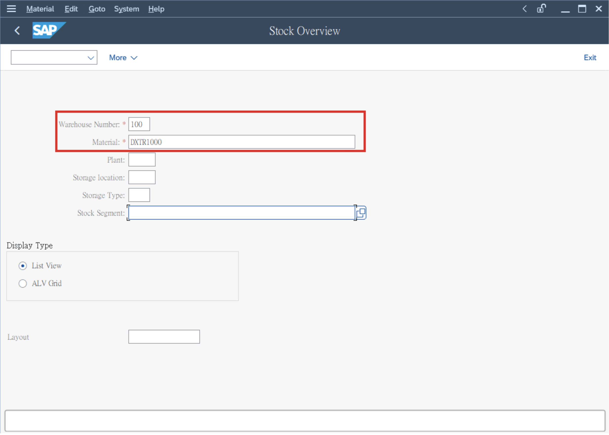

**圖 18：LS26 搜尋介面** — 輸入倉庫號碼（100）與物料代碼，查詢標準 SAP 倉庫物料概覽。

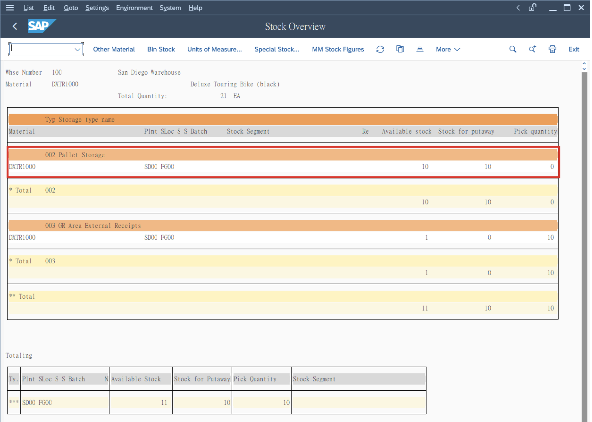

**圖 19：物料搜尋結果（DXTR1000）** — DXTR1000 在各倉儲類型的庫存數值，用於與報表 Level 2（圖 5）數據進行核對驗證。

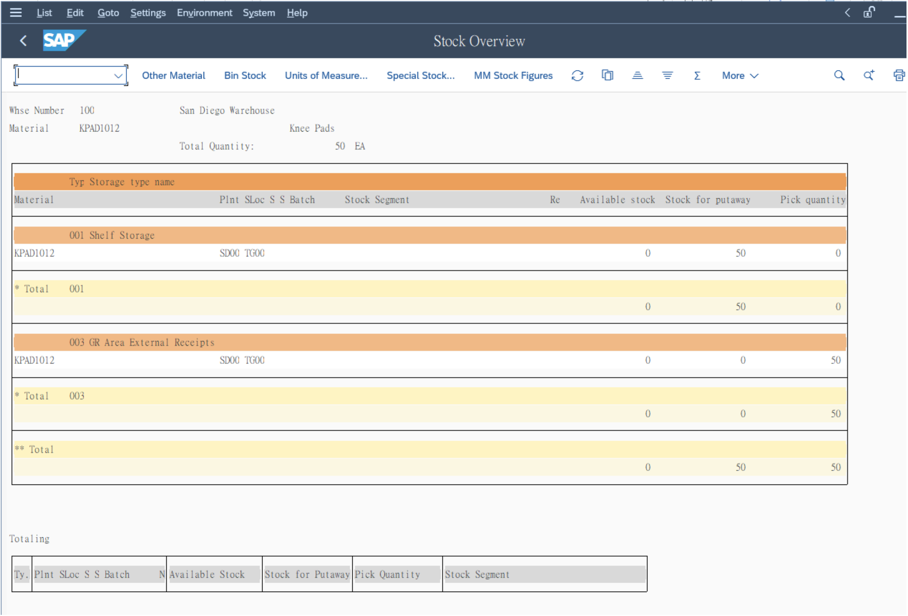

**圖 20：物料搜尋結果（KPAD1012）** — KPAD1012 在各倉儲類型的庫存數值，兩個儲位皆為 0，與 Level 2 紅色警示（圖 6）結果一致。

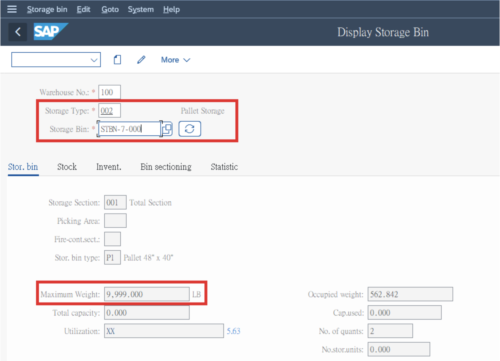

**圖 21：LS03N 搜尋介面（DXTR1000）** — 查詢 STBN-7-000 儲位的最大容量重量（9999 LB）與已使用重量（562.842 LB），數值與 Level 3 報表（圖 7）核對一致。

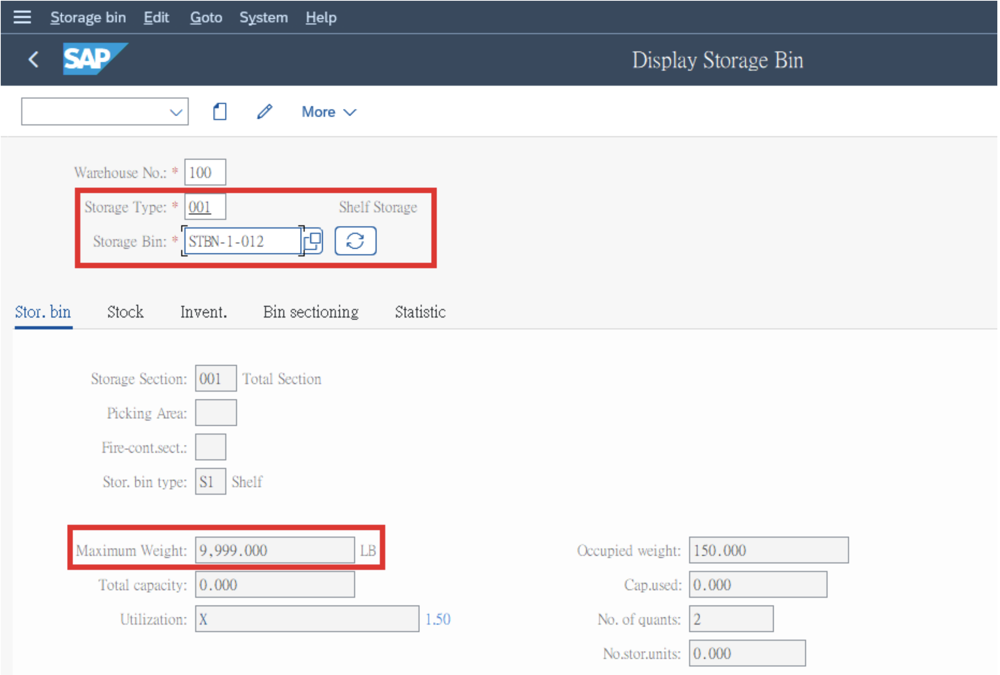

**圖 22：LS03N 搜尋介面（KPAD1012）** — 查詢 STBN-1-012 儲位的物理屬性，與 Level 3 報表（圖 9）顯示數據進行驗證。

---

## 技術架構 (Technical Architecture)

```
┌─────────────────────────────────────────────────────┐
│                  SELECTION SCREEN                   │
│          s_lgnum (倉庫) / s_matnr (物料)             │
└──────────────────────┬──────────────────────────────┘
                       │ START-OF-SELECTION
                       ▼
┌─────────────────────────────────────────────────────┐
│                  lcl_app::run()                     │
│           Report Program (WRITE-based)              │
│                                                     │
│  Level 1 ──(AT LINE-SELECTION + HIDE)──▶ Level 2   │
│  Level 2 ──(AT LINE-SELECTION + HIDE)──▶ Level 3   │
│  Level 2 ──(AT LINE-SELECTION, 低庫存)──▶ Screen 9000 │
└──────────────────────┬──────────────────────────────┘
                       │ CALL SCREEN 9000
                       ▼
┌─────────────────────────────────────────────────────┐
│            Dialog Program (Screen 9000)             │
│        lcl_app::dialog_pai()  防呆檢核              │
│        lcl_app::create_transfer_order()             │
│           INSERT INTO LTAK + LTAP                   │
└──────────────────────┬──────────────────────────────┘
                       │ SUPPRESS DIALOG +
                       │ LEAVE TO LIST-PROCESSING
                       ▼
┌─────────────────────────────────────────────────────┐
│         lcl_app::show_transfer_log()                │
│              任務追蹤清單（閉環確認）                 │
└─────────────────────────────────────────────────────┘
```

| 技術項目 | 說明 |
|----------|------|
| **語言** | 100% Object-Oriented ABAP（OO ABAP），捨棄 `PERFORM / FORM / ENDFORM` |
| **報表輸出** | `WRITE` 排版（不使用 ALV） |
| **畫面技術** | Dialog Programming — Screen 9000（補貨輸入）/ Screen 9001（轉接）|
| **事件驅動** | `AT LINE-SELECTION` 處理下鑽，`HIDE` 語法傳遞階層鍵值 |
| **訊息機制** | 標準 `ABAP MESSAGE` — Type E（錯誤阻擋）/ Type S（操作確認）|
| **介面設計** | SE51（Screen Painter）/ SE41（Menu Painter）設計補貨視窗與選單 |

---

## AI 協作紀錄 (AI Collaboration)

| 工具 | 使用階段 | 主要任務 |
|------|----------|----------|
| **Gemini** | 專案啟動 | 商業情境發想、初始系統設計文件（Markdown）產出 |
| **GitHub Copilot** | 全程開發 | 程式架構分析、資料表欄位驗證、程式碼生成與審查 |

**實務挑戰與解法：**

| 問題 | 解法 |
|------|------|
| `MAKT-MAKTX` JOIN 欄位錯誤對應 | 與 Copilot 逐欄核對資料表定義 |
| Screen Stack 異常：底層報表重複觸發 Screen 9000 | 以 `SUPPRESS DIALOG` 正確清除畫面堆疊 |
| `MINBE` 全為 0，預警功能無法生效 | 改以「可用庫存 < 10」為門檻，保留未來切換 MINBE 判斷的彈性 |
| Copilot Context Window（160K tokens）耗盡 | 重新輸入開發規範，並靈活切換 LLM 工具推進開發 |

---

## 專案結構 (Project Structure)

```
SAP-ABAP-Project-Warehouse-Storage-Location-Material-Distribution-Explorer/
│
├── Z01_WAREHOUSE.prog.abap                    # 三層互動式庫存報表主程式
├── ZFIN01_12_053068_WM_WAREHOUSE.prog.abap    # 整合補貨系統完整版主程式
│
├── images/
│   ├── er_model/
│   │   └── er_model_final.png                 # 圖 1
│   │
│   ├── report/
│   │   ├── selection_screen.png               # 圖 2
│   │   ├── level1_overview.png                # 圖 3
│   │   ├── level1_alert.png                   # 圖 4
│   │   ├── level2_dxtr1000.png                # 圖 5、圖 11
│   │   ├── level2_kpad1012.png                # 圖 6
│   │   ├── level3_stbn7000.png                # 圖 7
│   │   ├── level3_4500000329.png              # 圖 8
│   │   ├── level3_stbn1012.png                # 圖 9
│   │   └── level3_popup.png                   # 圖 10
│   │
│   ├── replenishment/
│   │   ├── dialog_screen9000.png              # 圖 12
│   │   ├── error_stock.png                    # 圖 13
│   │   ├── error_qty.png                      # 圖 14
│   │   ├── upstream_notice.png                # 圖 15
│   │   ├── success_message.png                # 圖 16
│   │   └── tracking_report.png                # 圖 17
│   │
│   └── sap_validation/
│       ├── ls26_search.png                    # 圖 18
│       ├── ls26_dxtr1000.png                  # 圖 19
│       ├── ls26_kpad1012.png                  # 圖 20
│       ├── ls03n_dxtr1000.png                 # 圖 21
│       └── ls03n_kpad1012.png                 # 圖 22
│
├── file1.pdf
├── file2.pdf
└── README.md
```

---

## 開發環境 (Development Environment)

- **SAP System:** SAP ERP with Warehouse Management (WM) module
- **開發工具:** SAP GUI — SE38 / SE51 / SE41 / SE16N / LS26 / LS03N
- **AI 協作工具:** GitHub Copilot（學生方案）/ Gemini（網頁版）
- **版本控管:** Git + GitHub
